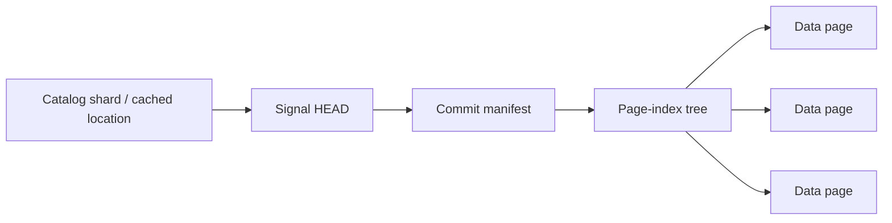

# Store layout

This document describes the implemented filesystem/XRootD store layout (store
format 3) and version 1 binary page format. Keep it synchronized with storage,
catalogs, timestamp encoding, publication, and recovery. Broader design goals and
remaining work live in [architecture.md](../architecture.md).

The store has three main layers: a global catalog of signal names, a separate
page index for each signal, and immutable `.pg` files containing measurements or
recovery metadata. There is no SQLite database in the new implementation.

`DB(path_or_url)` opens read-only by default. It does not create missing stores,
initialize catalogs, or repair recovery files. Creating, updating, or repairing a
store requires explicit `mode="a"` (open/create) or `mode="x"` (create exclusively).

## Global directory structure

```text
store/
├── store.json                         # Database identity and configuration
├── catalog/
│   ├── HEAD.json                      # Shard references, next signal slot, intents
│   ├── LOCK.lock                      # Coordinates allocation and name changes
│   └── shards/<uuid>.json             # Up to 128 current location/name shards
├── pages/recovery/
│   ├── store-<config-id>.0.pg          # Database configuration recovery
│   └── store-<config-id>.1.pg          # Independent second copy
└── signals/
    ├── 00-<signal-hash>/               # First signal, allocation ordinal 0
    │   ├── SIGNAL.json                # Immutable name/ordinal/database identity
    │   ├── HEAD.json                  # Current committed version
    │   ├── LOCK.lock                  # Coordinates writers to this signal
    │   ├── manifests/<uuid>.json       # Generations 1–128
    │   ├── manifests/01/<uuid>.json    # Generations 129–256
    │   ├── index/<uuid>.json           # Index-node ordinals 0–127
    │   ├── index/01/<uuid>.json        # Index-node ordinals 128–255
    │   └── pages/
    │       ├── 00-<page-id>.pg         # Page ordinal 0
    │       ├── 7f-<page-id>.pg         # Page ordinal 127
    │       ├── 01/00-<page-id>.pg      # Page ordinal 128
    │       ├── 01/00/00-<page-id>.pg   # Page ordinal 16,384
    │       └── recovery/
    │           ├── <commit-id>.0.pg
    │           ├── <commit-id>.1.pg
    │           ├── 01/<commit-id>.0.pg # Generations 129–256
    │           └── 01/<commit-id>.1.pg
    ├── 7f-<signal-hash>/               # Signal ordinal 127
    ├── 01/00-<signal-hash>/            # Signal ordinal 128
    └── 01/00/00-<signal-hash>/         # Signal ordinal 16,384
```

The lock filenames shown are for local filesystems. Directory-lock profiles use
`LOCK.LOCK` directories instead. Local advisory-lock files remain in place so
writers continue to coordinate through the same inode. Publication also uses
temporary `.pending` files, which are not finalized pages.

XRootD uses the same directory layout and page bytes. EOS locks are exclusive
`.LOCK` directories containing a unique `owner-<token>` record. Generic XRootD
keeps `.LOCK` directories permanently and locks by exclusive creation of their
`owner` file. Owner records contain a token, host, PID, and start time and are
verified before release. The `eos-mkdir` and `xrootd-exclusive` families are
persisted in `store.json`; incompatible writable clients are rejected.

`store.json` records the database UUID, configuration ID, format version, default
page size, and coordination settings. JSON metadata uses deterministic
serialization and a checksummed envelope. References to immutable metadata also
carry a SHA-256 digest of the referenced file.

The global catalog contains names, stable signal ordinals, and live/deleted
membership, not measurement manifests or page descriptors. Its small checksummed
`HEAD.json` (catalog schema version 2) references up to 128 immutable shards and
stores `next_signal_ordinal` and pending name changes. A shard has parallel
`names`, `ordinals`, and `live` arrays, sorted by name. The first seven bits of the
name's SHA-256 select its logical shard. Current shard files are flat under
`catalog/shards/`; replacements are retired, so this collection needs no radix
tree. Search caches these columns and the merged live-name list in memory,
checks HEAD on each call, and reloads only changed shards.

### Adaptive allocation

Signal directories and each signal's pages, index nodes, manifests, and recovery
files grow independently in **base 128**. Two hexadecimal digits encode each radix
digit (`00` through `7f`). Depth follows the allocation ordinal; there is no
configured directory depth and no directory scan to decide where to write.

| Zero-based ordinal | Example measurement path under `pages/` | Extra directory levels |
| --- | --- | --- |
| 0–127 | `00-<uuid>.pg` through `7f-<uuid>.pg` | 0 |
| 128–16,383 | `01/00-<uuid>.pg` through `7f/7f-<uuid>.pg` | 1 |
| 16,384–2,097,151 | `01/00/00-<uuid>.pg` through `7f/7f/7f-<uuid>.pg` | 2 |
| 2,097,152 onward | `01/00/00/00-<uuid>.pg`, and deeper as needed | 3 or more |

Growth adds paths for new objects; it never moves existing files or wraps the
old tree in a new root. Fill sibling slots before adding depth. Signal directories
use the same ordinal path with a SHA-256 name suffix instead of a page UUID.
The hash verifies identity and keeps raw signal names out of paths; it does not
choose the directory depth. Manifests, index nodes, and recovery records use the
ordinal's parent directory and UUID filenames.

| Collection | Allocation ordinal | Normal finalized entries per directory, excluding radix children |
| --- | --- | --- |
| Signal directories | Global next signal ordinal | 128 signal directories |
| Measurement pages | Signal's next page ordinal | 128 files |
| Index nodes | Signal's next index-node ordinal | 128 files |
| Manifests | Commit generation minus one | 128 files |
| Signal recovery | Commit generation minus one, two copies | 256 files |

Each collection directory can also acquire up to 128 radix child directories.
Normal fanout is therefore at most 256 entries, or 384 for paired recovery files;
the measurement root also has a single `recovery/` directory. Aborted writes can
leave UUID files at reused object ordinals, and pending uploads temporarily add
entries. These bounds describe normal allocation, not hard quotas against orphan
accumulation. Reclaiming unreferenced measurement/index/recovery files is separate
maintenance. Database-scope recovery has only two configuration copies.

### Stable signal locations and concurrency

For a new name, a writer takes the catalog lock, durably reserves an ordinal in
the catalog, then publishes its immutable `SIGNAL.json` identity. This contains the
database UUID, exact name, name hash, and signal ordinal. Only after both steps
succeed does allocation return the location. The writer releases the catalog lock
before acquiring the signal lock and writing data. Existing signals retain their
locations through deletion, recreation, and catalog rebuilding; hot writes need
only the signal lock. Readers and writers cache anchored locations, with a bounded
4,096-name hot cache in addition to lazily loaded catalog shards.

Opening a DB reads no signal catalog. A first exact-name lookup reads one shard
and its identity anchor, then follows the signal HEAD. Later exact lookups reuse
its stable location. No full namespace scan or full name-cache load is needed.
If the catalog is missing or damaged, exact reads can fall back to a metadata scan;
normal searches require explicit rebuilding of corrupt catalogs.

`db.refresh()` discards the instance's cached names/shards, signal locations,
verified identities, and recovery verification results. Reloading is lazy: the
next search or read fetches its required metadata again. Refresh itself performs
no I/O, writes, or namespace scans, and works read-only. Ordinary operations
already reread signal HEADs and check for catalog changes. Entered iterators keep
their captured immutable snapshots; arrays remain valid. Native XRootD reads use
`REFRESH` opens, while weak mounted reads remain limited by mount-cache visibility.
Refreshing does not flush external caches, wait for commits, clear writer locks,
or reset protection after an ambiguous remote mutation.

An interrupted reservation is hidden from search until a live signal HEAD is
committed. A retry uses the reserved location. Rebuilding preserves all anchored
locations, including reservations without a HEAD and fully deleted signals.
Reservations interrupted before identity publication can be discarded by rebuild;
no successful allocating writer has received them, and readers do not cache them
as permanent locations. Ambiguous remote mutations retain the catalog lock, as
with other ambiguous publications.

Creation, recreation, and full deletion publish a durable name-change intent
under the catalog lock before changing signal HEAD. Search resolves pending names
against their signal HEADs, so committed creations are discoverable and
uncommitted ones remain excluded. Pending deletions disappear only after their
signal HEAD changes. Pending names override cached shard membership in both
directions. Finalization updates the shard's live flag and removes the intent;
it keeps the name and ordinal even after deletion. Measurement updates and partial
deletions never take the catalog lock.

`db.rebuild_catalog()` walks radix branches at any depth, reading identities,
HEADs, and manifests without listing signal data/index subtrees or reading
measurement pages. It reconstructs locations, membership, and the next ordinal
under the catalog lock. A surviving HEAD/manifest supplies a missing identity;
the next writer can recreate its anchor. Missing catalog metadata is rebuilt on
the first writable search or new-signal allocation; read-only searches scan
signal metadata until then.

Only store format **3** is supported. Earlier layouts have no compatibility code
or automatic conversion. Opening and committed-state recovery reject unsupported
store versions before writing. Binary pages remain version 1. Recovery and salvage
allocate current-layout locations in a new destination while reusing verified
measurement bytes; data-only salvage interprets supported pages independently of
their original directory names.

## Signal versions and page indexes

`db.info_signal(name)` reads one signal's index metadata for active-page counts,
sizes, and schema statistics. Its `stored_bytes` excludes retired pages and other
store files. `db.info()` instead returns a `StoreInfo` with `size_bytes`,
`signal_count`, `record_count`, and `size_basis`. It sums live record counts from
manifest root summaries and walks the complete namespace for storage usage,
including metadata, recovery files, retired/unreferenced pages, and pending files.
Deleted signals and uncommitted reservations contribute space but no live counts.
Counts enumerate authoritative signal identities and HEADs independently of the
name cache, so missing or damaged derived catalogs do not require repair first.

On filesystems exposing allocation, `size_basis="allocated"` uses disk blocks,
including directory blocks, with hard links counted once and symlinks not followed.
XRootD and weak mounts use `size_basis="logical"`: all file lengths, without
unavailable server allocation/replica overhead. Native XRootD combines directory
listing and stat information, avoiding payload downloads and normally avoiding a
stat request per file. No counters are added to the shared write path. `info()`
does not change storage or acquire writer locks; it is a potentially expensive
scan and totals can vary while writers are active. `repr(db)` performs no I/O.

The read path for one signal is:



`HEAD.json` contains the current commit ID and the manifest's location and
checksum. The manifest records:

- Signal identity and allocation ordinal, timestamp kind, generation, and page-size
  setting.
- The root of the current page-index tree and its aggregate counts and sizes.
- The parent commit and recovery information.
- Pages added and removed by this commit, and the next page and index-node ordinals.

The page index orders pages by timestamp range. Leaf nodes hold up to 128 page
descriptors; internal nodes hold up to 64 child references. Nodes also have a
256 KiB serialized size limit. Descriptors contain page locations, hashes, time
bounds, record counts, schemas, and statistics. Subtree summaries allow reads to
skip irrelevant branches and answer some counts without opening measurement
pages.

Updates write new pages and changed index nodes, then a new manifest. Atomically
replacing the signal HEAD makes the new version visible. Unchanged index branches
are reused, and existing readers can continue using the previous immutable files.
Ordinary `store()`, deletion, and configuration calls acquire the necessary backend
locks automatically. Concurrent workers use separate DB instances with the same
API; no parallel mode or worker registration changes the layout or commit protocol.
The optional `ingest()` method adds stream buffering and grouped commits.
The writer then publishes both recovery copies before acknowledging a successful
write. A failure after HEAD publication must be treated as a potentially committed
or explicitly committed operation, not blindly replayed as an uncommitted write.

### Deletion and empty checkpoints

`db.delete_signal(name, t1=None, t2=None, *, timezone=None)` removes records in an
inclusive interval and returns their count. It retires fully covered pages using
index metadata alone, verifies and rewrites boundary-page survivors, and reuses
unaffected pages and index branches. No matching records means no commit.

Removing every record publishes a manifest with `root: null` and a full recovery
checkpoint whose page roster is empty and totals are all zero. This **tombstone**
retains the signal name, generation, configuration, ancestry, and allocation
counters. Its HEAD and lock paths remain in place. Search omits the name and exact
reads raise `SignalNotFoundError`. A full deletion can use the root's count without
loading its page descriptors or measurement payloads.

Recreation publishes a new checkpoint, continues the generation/allocation
counters, and re-registers the name. It may select a new timestamp kind and uses
the database's default page size unless explicitly overridden. Recovery and
integrity checks include tombstones even though ordinary discovery omits them.
`RecoveryReport.deleted_signals` identifies preserved deletions separately from
live `recovered_signals`. `repair_recovery(name)` also accepts deleted names.

Deletion retires references; it does not unlink immutable pages or reclaim disk
space. Existing snapshot readers stay valid. Offline committed-state recovery
honors surviving deletion checkpoints; data-only salvage cannot infer deletion
and may restore those old measurement pages. All clients use the current format,
including its empty-checkpoint deletion semantics.

### Remote publication and weak mounts

The XRootD adapter uses the same keys and binary format. `root://` and `roots://`
select it; `/eos/` paths select its EOS profile. Uploads stream through the Python
client into unique `.pending` names in the target directory, with bounded buffers.
The EOS profile adds `eos.atomic=1` to those uploads. Each file is synced and closed
at the server, then its namespace size and server checksum are confirmed before
rename exposes its final name. Adler-32 or SHA-256 server checksums are compared
with streaming client checksums; an unsupported checksum uses a full SHA-256
readback instead. This transport check supplements the page's own SHA-256 hashes.
Mutable metadata and new JSON files are confirmed by reading their content after
rename. A server must implement atomic rename over an existing file; the adapter
never deletes the old HEAD first.

The locking primitive depends on the server profile. EOS's namespace `mkdir` is
exclusive; an existing directory remains locked even if its owner record was
never written. A unique owner filename avoids reusing cached file identities.
Generic XRootD uses `OpenFlags.NEW` on `.LOCK/owner` without POSC or EOS atomic
upload: an interrupted writer leaves even an empty owner file locked. Its directory
is retained after the owner file is removed. Native tests exposed why these
protocols differ: generic `mkdir` may succeed on existing directories, while EOS
can accept multiple `NEW` opens before the first close. All participants must use
the persisted coordination family. Permission/authentication failures remain
distinct from missing files and contention. Ambiguous mutation results retain
held locks and disable the affected writer instance. Neither a stale HEAD nor a
missing file proves that an outstanding remote rename will not execute later.
Reconciliation must establish the request's outcome and stop the old writer before
releasing its locks. Locks are never automatically stolen or expired.

DB page reads, metadata access, and name-catalog scans use backend methods rather
than assuming local paths. Native remote pages are downloaded into owned buffers
and always fully verified. Referenced files that are temporarily missing or fail
verification are retried within `visibility_timeout`; each protocol request has
its own `io_timeout`. The protocol does not provide a transactional snapshot of
multiple signals or prove durability beyond the storage service's acknowledgments.

EOS/SSHFS close, `fsync`, and cached readback are not treated as an EOS acknowledgment.
`DB(mounted_path, mode="a", xrootd_url=authoritative_store_url)` routes **all** I/O and locks
to XRootD; the caller supplies the correspondence between mount path and URL.
There is no mixed mounted-data/native-HEAD writer. Unconfigured weak mounts reject
writes even with a `generic` or `local` profile override. Read-only mounted access
uses verified byte snapshots, with bounded retry for incomplete files; a valid
older snapshot can still be returned by the mount cache. The normal local mmap
read path remains unchanged.

Synthetic EOS integration tests cover concurrent workers on one client host,
server publication, cross-process contention, and the mounted alias/read-only
paths. Distributed outage, server failover, and multi-host durability qualification
remain separate deployment work. Offline `recover` and `salvage` currently accept
filesystem directories; native remote scanning/reconstruction is not implemented.

Page ordinals use base-128 directory components: ordinal 0 is `00-<uuid>.pg`,
ordinal 128 is `01/00-<uuid>.pg`, and ordinal 16,384 is
`01/00/00-<uuid>.pg`. The UUID keeps keys unique, including after aborted writes.
Manifests and indexes store the exact relative keys; reads do not derive page
membership from directory listings.

Older measurement, index, manifest, and recovery files currently remain on disk;
their garbage collection is not implemented. Replaced name-catalog shards are
reclaimed because they are derived metadata. Readers retry against the newer
catalog HEAD if a captured shard has just been retired.

## Measurement page structure

A measurement page is a custom binary container, not an NPY file or a pickle:

```text
16-byte prefix
    magic, format version, flags, JSON-header length

Primary JSON header
32-byte header SHA-256

Padding to a 64-byte boundary
Timestamp array

Padding to a 64-byte boundary
Offsets array                         # Only for ragged records

Padding to a 64-byte boundary
Value array

Padding to a 64-byte boundary
Backup copy of the JSON header
32-byte backup-header SHA-256

128-byte trailer
    backup-header location, file length, header hash, etc.
    final 32 bytes: SHA-256 of all preceding file bytes
```

The binary prefix and trailer use little-endian fields. Each JSON header is at
most 64 KiB. Padding bytes are zero, and the whole-page digest includes the prefix,
both headers and their hashes, array contents, padding, and trailer fields before
the final digest.

The header makes the page independently interpretable. It contains the database
and signal identities, database configuration, page UUID and ordinal, upload batch
ID, timestamp semantics, record count, time bounds, schema, and statistics. Each
array section declares its dtype, byte order, shape, C memory order, byte offset,
byte length, and SHA-256.

All multibyte arrays use explicit little-endian encoding:

| Array | Stored representation |
| --- | --- |
| Integer timestamps | `<i8` |
| Floating measurement axes | `<f8` |
| Datetime timestamps | `<i8`, UTC nanoseconds since 1970-01-01 |
| Ragged-record offsets | `<u8` |
| Values | Explicit dtype, such as `<f8` or `<i2` |

Single-byte types and byte strings use `|` dtype notation and declare byte order
not applicable. Numeric axes retain caller-defined units; they are not implicitly
interpreted as epoch timestamps. Timezone selection affects datetime parsing;
stored datetimes always represent UTC instants.

Dense records use `timestamps[N]` and `values[N, ...record_shape]`. Ragged records
add `offsets[N+1]`, which identifies each record's slice within the concatenated
values array. Offsets count positions along the first values dimension, not bytes.
Timestamps are strictly increasing within a data page. Each page has one schema;
changes in dtype or record shape produce separate pages. Arrays are currently
uncompressed and can be read through read-only memory mapping.

The default data-page limit is 8 MiB, including metadata, configurable per signal.
A single record larger than the limit gets its own oversized page. The limit
applies to data pages; recovery checkpoints describing many pages can be larger.

## Recovery pages and integrity

For low-level assessment of one measurement page, use the public
`pagestore.read_page(path)` function:

```python
from pagestore import read_page

name, timestamps, records = read_page("./anonymous-page.pg")
```

It needs no database directory or recovery record. It checks both header copies,
every section hash, the whole-page SHA-256, signal identity, and record consistency
before returning data. Corruption raises `CorruptionError`; an intact recovery
page raises `ValueError`. It does not repair files. The arrays own writable,
native-endian memory; ragged records are an object array of NumPy arrays. Numeric
axes retain their numeric dtype and datetimes are UTC `datetime64[ns]`. Successful
verification establishes page integrity, not its former commit status. Damaged
envelopes require the explicit salvage operation described below.

Recovery pages use the same binary container, but their payload is a JSON recovery
record stored as a byte-array section. Each successfully acknowledged commit has
two copies:

- A checkpoint describes the complete active page set.
- A delta describes added and retired pages and links to the preceding recovery
  record by commit ID and digest.

Database-scope recovery pages preserve root configuration, including for an empty
store. Signal-scope recovery records preserve signal identity, configuration,
generation, page descriptors, and commit membership.

These records establish which data pages belong to committed versions. A complete
set of data and recovery pages can reconstruct the database even if the JSON
metadata and original directory layout are lost. Measurement pages alone cannot
distinguish an active page from an uncommitted upload or a retired version.
`maintenance.recover` creates a separate destination and rebuilds its indexes and
name catalog from those confirmed records. It preserves committed-state semantics
and reports an incomplete reconstruction if required pages or recovery records
are missing.

There is a separate catastrophic-loss operation,
`maintenance.salvage(source, destination)`. It needs only measurement pages: no
`store.json`, HEADs, manifests, indexes, name catalog, or recovery records. Each
data page already contains enough information to validate its arrays, identify
its signal, and interpret its timestamps and values. This operation adds no
metadata or work to ordinary writes.

Salvage fully verifies every selected page. Intact pages are copied byte-for-byte,
then indexed in a new store with fresh commits and recovery records. Their embedded
database UUID is retained so their bytes can be reused. The new store infers its
coordination profile, defaults to 8 MiB data pages, and takes each signal's page-size
setting from the largest setting recorded in its selected pages; the original
current configuration is not assumed recoverable. Pages from different database
UUIDs require separate salvage runs.

Use `reuse="hardlink"` to reuse intact files without copying payload bytes on a
filesystem supporting hard links. This requires the same filesystem and continued
immutability of the shared source files. Unsupported linking fails explicitly;
it never silently starts a large copy. Damaged envelopes are repaired into new
files even in hardlink mode. The source must be quiescent and is not overwritten.

When one header survives, payload sections can still be checked independently.
Salvage can rebuild damaged prefix/header/trailer/padding bytes. A truncated
metadata-only tail can also be reconstructed if the primary header and all array
bytes survive. If the original whole-page digest survives, the repair must
reproduce it. If that digest is lost, salvage may generate a new envelope digest
only after verifying every array against an intact header; this is explicitly
listed under `regenerated_digests` in the report. Strict committed-state recovery
continues to require its trusted original digest. Payload damage, missing array
bytes, or loss of both usable header copies causes the affected page to be rejected.

Verified data does not establish the original commit status. Salvage may include
retired or uncommitted pages, and cannot know about completely missing pages.
Identical copies of a page are deduplicated. If candidate pages for one signal
overlap in time, disagree on timestamp kind, or give conflicting contents for one
page ID, the entire signal is excluded and its candidate paths are reported.
Salvage never guesses the latest version. Supply `pages=[...]` with an explicit
selection in a new run to resolve conflicts. Valid pages from other signals can
still be salvaged; rejecting a damaged page may leave a gap within a signal.

`SalvageReport.ok` means the supplied candidates were processed without rejections,
conflicts, or errors; it does not assert historical completeness. The report always
labels original commit status as `unknown`. `salvage-report.json` records exclusions,
repairs, and counts; `salvage-pages.jsonl` maps imported source files to destination
pages and new commit IDs. Metadata is temporarily partitioned into 256 files to
avoid holding the whole store's descriptor inventory in memory. Memory still scales
with the largest partition, and an unusually large single signal can dominate it.
Use `scratch_directory=` to choose the temporary inventory location.

Duplicate headers and recovery records protect metadata; they do not duplicate
measurement payloads. Hashes detect payload damage, but repairing damaged
measurements requires another verified copy or backup. Ordinary reads validate
metadata and structural consistency; `db.check(full=True)` additionally verifies
payload hashes, ordering, and statistics. Integrity checks enumerate authoritative
signal HEADs independently of the name cache so missing cache entries cannot hide
signals from verification.

For a historical example from the earlier layout, one signal in the million-signal
benchmark contains 32
integer timestamps and 32 float64 values: 512 bytes of measurements inside a
3,250-byte data page. Its HEAD, manifest, index, lock file, and two recovery pages
are additional files. The current layout also stores `SIGNAL.json`. This illustrates the overhead for very small signals; see
the [benchmark results](../benchmarks/README.md) for measured whole-store costs.

The implementation lives in [db.py](../pagestore/db.py),
[name_catalog.py](../pagestore/name_catalog.py),
[page_index.py](../pagestore/page_index.py), and
[page_format.py](../pagestore/page_format.py). Data-only salvage is implemented in
[salvage.py](../pagestore/salvage.py).

Migration bookkeeping is separate from this layout. The bounded EOS pilot keeps
frozen legacy metadata, source-file identities, checksums, immutable attempt
receipts, and verification reports under a sibling `store-migration/` directory.
These audit files are not required to read or recover the new store. `DB.info()`
counts the store itself; working-space accounting must additionally include the
audit tree, local staging, and offline recovery fixtures.
