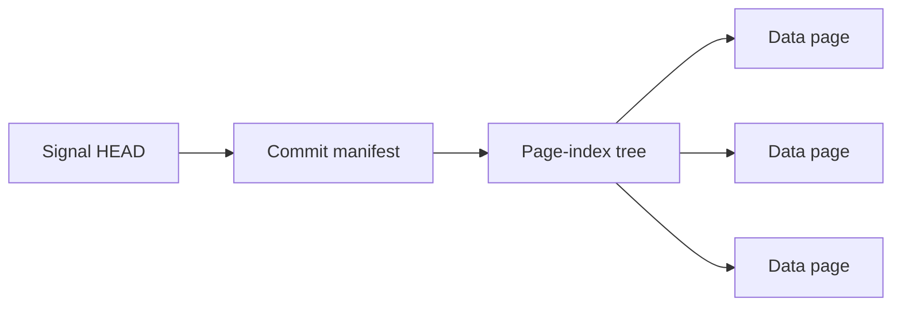

# Store layout

This document describes the implemented filesystem store and version 1 page
format. Keep it synchronized with changes to storage, catalogs, timestamp
encoding, publication, and recovery. Broader design goals and remaining work live
in [architecture.md](../architecture.md).

The store has three main layers: a global catalog of signal names, a separate
page index for each signal, and immutable `.pg` files containing measurements or
recovery metadata. There is no SQLite database in the new implementation.

## Global directory structure

```text
store/
├── store.json                         # Database identity and configuration
├── catalog/
│   ├── HEAD.json                      # Name-catalog shard references and intents
│   ├── LOCK.lock                      # Coordinates new signal registration
│   └── shards/ab/<uuid>.json           # Sorted signal names
├── pages/recovery/
│   ├── store-<config-id>.0.pg          # Database configuration recovery
│   └── store-<config-id>.1.pg          # Independent second copy
└── signals/
    └── ab/<signal-hash>/
        ├── HEAD.json                  # Current committed version
        ├── LOCK.lock                  # Coordinates writers to this signal
        ├── manifests/<uuid>.json       # Immutable commit descriptions
        ├── index/<uuid>.json           # Immutable page-index tree nodes
        └── pages/
            ├── 00-<page-id>.pg         # Measurement pages
            ├── 01-<page-id>.pg
            ├── 01/00-<page-id>.pg      # Page ordinal 100
            └── recovery/
                ├── <commit-id>.0.pg
                └── <commit-id>.1.pg
```

The lock filenames shown are for local filesystems. Directory-lock profiles use
`LOCK.LOCK` directories instead. Local advisory-lock files remain in place so
writers continue to coordinate through the same inode. Publication also uses
temporary `.pending` files, which are not finalized pages.

`store.json` records the database UUID, configuration ID, format version, default
page size, and coordination settings. JSON metadata uses deterministic
serialization and a checksummed envelope. References to immutable metadata also
carry a SHA-256 digest of the referenced file.

The global name catalog contains names, not measurement manifests or page
descriptors. Its small `HEAD.json` references up to 256 checksummed name shards.
Search loads these names into memory and checks that HEAD for changes on each
call. Only changed shards are reloaded.

A signal's directory is determined directly from the SHA-256 of its exact UTF-8
name; the first two hexadecimal digits shard the directories. Reading a known
signal therefore does not need the global name catalog. The original name is
also stored in its metadata and pages and checked against the requested identity.

New signal creation updates the name catalog under its own lock. Before publishing
the signal HEAD, the writer records a durable creation intent in the catalog.
Search resolves pending names against their signal HEADs, so an interrupted
creation is discoverable if committed and excluded if uncommitted. Successful
creation moves the name into its shard and removes the intent. Updates to
existing signals never take the catalog lock.

`db.rebuild_catalog()` reconstructs name discovery from signal HEADs and manifests
without reading measurement pages. An older store without a name catalog builds
it on the first writable search or new-signal creation; read-only searches retain
the HEAD-scan fallback until then. After older code adds signals without maintaining
the catalog, rebuild it before relying on search.

## Signal versions and page indexes

The read path for one signal is:



`HEAD.json` contains the current commit ID and the manifest's location and
checksum. The manifest records:

- Signal identity, timestamp kind, generation, and page-size setting.
- The root of the current page-index tree and its aggregate counts and sizes.
- The parent commit and recovery information.
- Pages added and removed by this commit, and the next page ordinal.

The page index orders pages by timestamp range. Leaf nodes hold up to 128 page
descriptors; internal nodes hold up to 64 child references. Nodes also have a
256 KiB serialized size limit. Descriptors contain page locations, hashes, time
bounds, record counts, schemas, and statistics. Subtree summaries allow reads to
skip irrelevant branches and answer some counts without opening measurement
pages.

Updates write new pages and changed index nodes, then a new manifest. Atomically
replacing the signal HEAD makes the new version visible. Unchanged index branches
are reused, and existing readers can continue using the previous immutable files.
The writer then publishes both recovery copies before acknowledging a successful
write. A failure after HEAD publication must be treated as a potentially committed
or explicitly committed operation, not blindly replayed as an uncommitted write.

Page ordinals use base-100 directory components: ordinal 0 is `00-<uuid>.pg`,
ordinal 100 is `01/00-<uuid>.pg`, and ordinal 10100 is
`01/01/00-<uuid>.pg`. The UUID keeps keys unique, including after aborted writes.
Manifests and indexes store the exact relative keys; reads do not derive page
membership from directory listings.

Older measurement, index, manifest, and recovery files currently remain on disk;
their garbage collection is not implemented. Replaced name-catalog shards are
reclaimed because they are derived metadata. Readers retry against the newer
catalog HEAD if a captured shard has just been retired.

## Measurement page structure

A measurement page is a custom binary container, not an NPY file or a pickle:

```text
16-byte prefix
    magic, format version, flags, JSON-header length

Primary JSON header
32-byte header SHA-256

Padding to a 64-byte boundary
Timestamp array

Padding to a 64-byte boundary
Offsets array                         # Only for ragged records

Padding to a 64-byte boundary
Value array

Padding to a 64-byte boundary
Backup copy of the JSON header
32-byte backup-header SHA-256

128-byte trailer
    backup-header location, file length, header hash, etc.
    final 32 bytes: SHA-256 of all preceding file bytes
```

The binary prefix and trailer use little-endian fields. Each JSON header is at
most 64 KiB. Padding bytes are zero, and the whole-page digest includes the prefix,
both headers and their hashes, array contents, padding, and trailer fields before
the final digest.

The header makes the page independently interpretable. It contains the database
and signal identities, database configuration, page UUID and ordinal, upload batch
ID, timestamp semantics, record count, time bounds, schema, and statistics. Each
array section declares its dtype, byte order, shape, C memory order, byte offset,
byte length, and SHA-256.

All multibyte arrays use explicit little-endian encoding:

| Array | Stored representation |
| --- | --- |
| Integer timestamps | `<i8` |
| Floating measurement axes | `<f8` |
| Datetime timestamps | `<i8`, UTC nanoseconds since 1970-01-01 |
| Ragged-record offsets | `<u8` |
| Values | Explicit dtype, such as `<f8` or `<i2` |

Single-byte types and byte strings use `|` dtype notation and declare byte order
not applicable. Numeric axes retain caller-defined units; they are not implicitly
interpreted as epoch timestamps. Timezone selection affects datetime parsing;
stored datetimes always represent UTC instants.

Dense records use `timestamps[N]` and `values[N, ...record_shape]`. Ragged records
add `offsets[N+1]`, which identifies each record's slice within the concatenated
values array. Offsets count positions along the first values dimension, not bytes.
Timestamps are strictly increasing within a data page. Each page has one schema;
changes in dtype or record shape produce separate pages. Arrays are currently
uncompressed and can be read through read-only memory mapping.

The default data-page limit is 8 MiB, including metadata, configurable per signal.
A single record larger than the limit gets its own oversized page. The limit
applies to data pages; recovery checkpoints describing many pages can be larger.

## Recovery pages and integrity

Recovery pages use the same binary container, but their payload is a JSON recovery
record stored as a byte-array section. Each successfully acknowledged commit has
two copies:

- A checkpoint describes the complete active page set.
- A delta describes added and retired pages and links to the preceding recovery
  record by commit ID and digest.

Database-scope recovery pages preserve root configuration, including for an empty
store. Signal-scope recovery records preserve signal identity, configuration,
generation, page descriptors, and commit membership.

These records establish which data pages belong to committed versions. A complete
set of data and recovery pages can reconstruct the database even if the JSON
metadata and original directory layout are lost. Measurement pages alone cannot
distinguish an active page from an uncommitted upload or a retired version.
Recovery creates a separate destination and rebuilds its indexes and name catalog.

Duplicate headers and recovery records protect metadata; they do not duplicate
measurement payloads. Hashes detect payload damage, but repairing damaged
measurements requires another verified copy or backup. Ordinary reads validate
metadata and structural consistency; `db.check(full=True)` additionally verifies
payload hashes, ordering, and statistics. Integrity checks enumerate authoritative
signal HEADs independently of the name cache so missing cache entries cannot hide
signals from verification.

For a concrete example, one signal in the million-signal benchmark contains 32
integer timestamps and 32 float64 values: 512 bytes of measurements inside a
3,250-byte data page. Its HEAD, manifest, index, lock file, and two recovery pages
are additional files. This illustrates the overhead for very small signals; see
the [benchmark results](../benchmarks/README.md) for measured whole-store costs.

The implementation lives in [db.py](../pagestore/db.py),
[name_catalog.py](../pagestore/name_catalog.py),
[page_index.py](../pagestore/page_index.py), and
[page_format.py](../pagestore/page_format.py).
